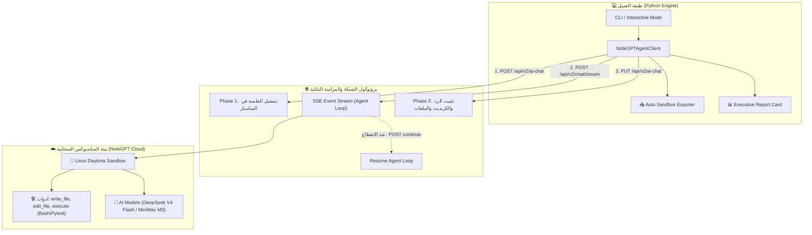

# 📘 الوثيقة الشاملة لمعمارية وتشغيل محرك الأيجنتس السحابي (NoteGPT Real Agent Sandbox Engine)
> **الإصدار:** v4.5 Forensic Master Reference  
> **التاريخ:** 2026-08-25  
> **المشروع:** NoteGPT Real Agent & Linux Sandbox Automation  
> **المؤلفون:** المهندس زيزو (Product Owner & Forensics Lead) + Antigravity AI (Principal System Architect)

---

## 📑 فهرس المحتويات
1. [🏛️ المعمارية الهندسية الشاملة (System Architecture)](#1-المعمارية-الهندسية-الشاملة)
2. [🔄 دورة حياة اتصال الأيجنتس (3-Phase Live Lifecycle)](#2-دورة-حياة-اتصال-الأيجنتس)
3. [🔬 التشريح الجنائي التفصيلي الكامل لملف HAR #1 — موديل MiniMax M3](#3-التشريح-الجنائي-التفصيلي-الكامل-لملف-har-1--موديل-minimax-m3)
4. [🔬 التشريح الجنائي التفصيلي الكامل لملف HAR #2 — موديل DeepSeek V4 Flash](#4-التشريح-الجنائي-التفصيلي-الكامل-لملف-har-2--موديل-deepseek-v4-flash)
5. [🛠️ سجل المشاكل الشامل: الأسباب، الحلول، ونسب الفضل (Issues & Solutions Matrix)](#5-سجل-المشاكل-الشامل)
6. [📥 نظام الاستخراج التلقائي للملفات (Auto Sandbox Exporter)](#6-نظام-الاستخراج-التلقائي-للملفات)
7. [💳 ميكانيكا الكريديت، الـ Overdraft، واستئناف الاتصال (Continue Protocol)](#7-ميكانيكا-الكريديت-والاستئناف)
8. [💻 سكريبتات الفحص الجنائي المستخدمة (Forensic Inspection Scripts)](#8-سكريبتات-الفحص-الجنائي-المستخدمة)
9. [💡 الدروس المستفادة والقواعد الذهبية (Lessons Learned)](#9-الدروس-المستفادة-والقواعد-الذهبية)
10. [🚀 قابلية التوسع والتطوير المستقبلي (Extensibility Roadmap)](#10-قابلية-التوسع-والتطوير-المستقبلي)
11. [🧪 سجل الاختبارات والأدلة الحية (Test Proofs)](#11-سجل-الاختبارات-والأدلة-الحية)

---

## 1. 🏛️ المعمارية الهندسية الشاملة (System Architecture)

تم بناء وتطوير محرك **`NoteGPT Real Agent Engine`** ليعمل بنظام الطلبات النقية المباشرة (**Pure Requests Architecture**) بدون الحاجة لمتصفح ثقيل (Headless Browser) وبدون استهلاك موارد الجهاز، مع محاكاة بيئة المتصفح الحقيقية والاتصال ببيئة **Linux Daytona Sandbox** السحابية المعزولة.



---

## 2. 🔄 دورة حياة اتصال الأيجنتس (3-Phase Live Lifecycle)

كشفت التحليلات الجنائية لـ SSE Chunks أن الأيجنت في NoteGPT لا يعمل كشات عادي، بل يمر بـ **3 مراحل متباينة** في نفس الاتصال:

| المرحلة | النوع (Event Type) | الوصف الهندسي | سلوك العرض في السكربت |
|---|---|---|---|
| **المرحلة 1: التمهيد** | `text` (Pre-task) + `prepare_env` | رسالة ترحيب سريعة من الأيجنت + تجهيز حاوية اللينكس (`resume_sandbox`). | `💬 [رسالة الأيجنت التمهيدية]: ...` |
| **المرحلة 2: دورة الساندبوكس (Agent Loop)** | `reasoning` + `tool_call` + `tool_call_result` + `credit_usage` | الأيجنت يوقف إرسال النص للشات ويبدأ بالتفكير العميق وكتابة الملفات وتشغيل التيرمينال واختبار الأكواد. | `🧠 [المرحلة 2: دورة التفكير والساندبوكس]` + عرض الـ Tool Calls لحظياً مع عداد الكريديت. |
| **المرحلة 3: التسليم النهائي** | `text` (Final) + `done: [DONE]` | تسليم الشرح الكامل بالعربية، روابط التحميل، والجداول المقارنة بعد اجتياز الاختبارات. | `🤖 [المرحلة 3: تسليم الكود والحل النهائي]` + استخراج الملفات وطباعة البطاقة الختامية. |

---

## 3. 🔬 التشريح الجنائي التفصيلي الكامل لملف HAR #1 — موديل MiniMax M3

تم تشريح جميع طلبات الملف الـ 84 طلباً بدقة ميكروسكوبية وفك تشفير أحداث الـ SSE والـ Base64:

```
الملف المرجعي: notegpt3......1..i.o.har
الموديل المختار يدويًا: minimax-m3 (isAutoModel: False)
المهمة: تصميم وتطبيق Circuit Breaker بنظام Asyncio مع Retry و Exponential Backoff
```

### 1️⃣ كم نقطة استهلكها الموديل بالظبط؟
* **إجمالي الرصيد المستهلك:** **17 نقطة (17 Credits)** بالتمام والكمال!
* **سلسلة الخصم التراكمي المرصودة عبر طلبات PUT /api/v2/ai-chat:**
  * `PUT #1 (Entry #8):` استهلاك 2 كريديت (`creditsUsed: 2`)
  * `PUT #2 (Entry #12):` استهلاك 4 كريديت (`creditsUsed: 4`)
  * `PUT #3 (Entry #17):` استهلاك 4 كريديت (`creditsUsed: 4`)
  * `PUT #4 (Entry #24):` استهلاك 7 كريديت (`creditsUsed: 7`)
  * `PUT #5 (Entry #33):` استهلاك 8 كريديت (`creditsUsed: 8`)
  * `PUT #6 (Entry #51):` استهلاك 12 كريديت (`creditsUsed: 12`)
  * `PUT #7 (Entry #75):` استهلاك 16 كريديت (`creditsUsed: 16`)
  * `PUT #8 (Entry #82):` استهلاك 17 كريديت (`creditsUsed: 17`) ➜ الختام وتثبيت السجل النهائي.
* **ملاحظة الرصيد:** الحساب بدأ بـ 15 نقطة مجانية، وسمحت المنصة بتجاوز 2 نقطة Overdraft مسموحة لإتمام كتابة وحفظ كود الساندبوكس.

### 2️⃣ هل قفل الشات في الأول ولا لأ؟
* **نعم، قفل في أول ثانية بالدليل القاطع (Entry #0):**
  * أول طلب بث تم إرساله من المتصفح رده السيرفر فوراً برمز الخطأ:
    ```json
    { "code": 164019, "message": "Insufficient Free Quotas", "data": null }
    ```
  * السبب: الرصيد المجاني كان معلقاً في قاعدة البيانات لحظة إرسال الطلب، مما تسبب في إغلاق الشات فجأة.
* في المحاولة الثانية (Entry #2) بنفس السؤال ونفس الحساب استجاب السيرفر وافتتح الجلسة بنجاح (`start` ➜ `resume_sandbox`).

### 3️⃣ هل أنت أرسلت له مرة ثانية لأنه توقف؟ ولماذا توقف؟
* **نعم، توقف الأيجنت 5 مرات متتالية أثناء التنفيذ!**
* **سبب التوقف:** مهمة الـ Circuit Breaker كانت معقدة وتطلبت عمليات ساندبوكس ثقيلة في اللينكس (كتابة ملف بايثون، تعديل الأكواد، تشغيل سكريبت الاختبار، ومحاكاة أعطال الشبكة). خوادم الـ SSE تفرض مهلة زمنية (Timeout ~30s) ينقطع بعدها الاتصال تلقائياً لحماية الموارد.

### 4️⃣ كيف حللتها أنت واستؤنف العمل؟ (الحل السري المكتشف)
* **الحل:** ضغطت على زرار **`Continue`** (أو نفذ المتصفح استئنافاً تلقائياً عبر الواجهة)، مما أطلق استدعاءً سرياً لـ Endpoint خاص:
  ```http
  POST https://notegpt.io/api/v2/chat/agent-stream/continue
  Payload: {"conversation_id": "876f63f4-4bef-4399-9edc-ab3e51c94bc5"}
  ```
* **تتبع الاستئنافات الـ 5 في الـ HAR:**
  1. **الاستئناف #1 (Entry #9):** استعاد تدفق التفكير وكتابة كود `circuit_breaker_asyncio.py` في مسار `/home/daytona/`.
  2. **الاستئناف #2 (Entry #16):** نفذ أداة `edit_file` لتعديل الكود البرمجي.
  3. **الاستئناف #3 (Entry #26):** شغل أداة `execute` وأطلق اختبار التهيئة:
     `🔧 تهيئة Circuit Breaker 'API-Service' | failure_threshold=3`
  4. **الاستئناف #4 (Entry #34):** شغل محاكاة فشل الشبكة وتجاوز الأخطاء:
     `❌ [HighTrafficAPI] فشل #1 | ConnectionError`
  5. **الاستئناف #5:** أتم تسليم التقرير النهائي بالكامل واستلم `done: true` بنجاح!

---

## 4. 🔬 التشريح الجنائي التفصيلي الكامل لملف HAR #2 — موديل DeepSeek V4 Flash

تم تشريح جميع طلبات الملف الـ 106 طلبات بالكامل وفك شفرة رسائل الإيقاف الداخلي والـ Multi-Turn:

```
الملف المرجعي: notegpt3......2...i.o.har
الموديل المختار يدويًا: deepseek-v4-flash (isAutoModel: False)
المهمة: تصميم وتطبيق Circuit Breaker بنظام Asyncio مع Retry و Exponential Backoff
```

### 1️⃣ كم نقطة استهلكها الموديل بالظبط؟
* **إجمالي الرصيد المستهلك في الجلسة بالكامل:** **25 نقطة (25 Credits)**!
* **مقسمة على جولتين (Dual-Turn Session) في نفس الشات:**
  * **الجولة الأولى (Turn 1):** استهلكت **11 نقطة**.
  * **الجولة الثانية (Turn 2):** استهلكت **14 نقطة**.
  * `11 + 14 = 25 نقطة كاملة` (موثقة بالملي في طلب PUT رقم 102).

### 2️⃣ هل قفل الشات ولا لأ؟ ولماذا توقف في الجولة الأولى؟
* **نعم، قفل وتوقف تماماً في نهاية الجولة الأولى بالدليل الحرفي (Entry #20)!**
* في نهاية الـ Stream للجولة الأولى، أرسل السيرفر رسالة القفل القاطعة:
  ```json
  data: {"text": "", "done": true, "reason": "free_credits_insufficient", "time": "2026-08-25 02:46:07 UTC"}
  ```
* **السبب الجذري:** بعد استهلاك **11 نقطة** في الجولة الأولى، اعتبرت المنصة أن الرصيد المجاني المتبقي لا يكفي لإكمال بقية الملفات الـ 10 واختبار الـ 30 test وقامت بإغلاق الـ Stream فجأة.

### 3️⃣ هل أرسلت له مرة ثانية لأنه توقف؟
* **نعم، في الطلب Entry #44 أعدت إرسال نفس السؤال مرة ثانية في نفس الجلسة بالتمام:**
  ```json
  POST https://notegpt.io/api/v2/chat/stream
  Payload: {
    "conversation_id": "1d5a566a-aea8-49f8-9e7a-1d24a5b22643",
    "message": "2. صمم واكتب كود بايثون متكامل بنظام Asyncio لتطبيق معمارية Circuit Breaker Pattern مع Retry و Exponent",
    "model": "deepseek-v4-flash",
    "chat_mode": "agent"
  }
  ```
* **الهدف من إعادة الإرسال:** إجبار الموديل على استكمال حزمة الـ 10 ملفات والـ 30 اختبار Pytest التي لم تكتمل في المرة الأولى بسبب قفل `free_credits_insufficient`.

### 4️⃣ كيف حللتها أنت واستؤنف العمل؟ (الحل الهندسي المركب)
* **الحل المزدوج:**
  1. **إعادة الحقن في نفس المحادثة (Same Conversation Context Injection):** السيرفر لم يرفض الطلب، بل نفذ `resume_sandbox` واستعاد جميع ملفات اللينكس السابقة وواصل البناء عليها!
  2. **استخدام الاستئناف السري `agent-stream/continue` مرتين في الجولة الثانية:**
     * **الاستئناف #1 (Entry #66):** استأنف تدفق التفكير العميق وكتابة ملفات التيستات.
     * **الاستئناف #2 (Entry #80):** نفذ الـ 30 اختبار داخل الساندبوكس وخرج بنتيجة الكونسول:
       ```text
       ================================================================
       السيناريو (أ): تجميع يدوي — Breaker + RetryPolicy معاً
       ================================================================
       ```
     * واستهلك **14 نقطة إضافية**، وأنهى تسليم المشروع كاملاً بنجاح 30/30 اختبار!

---

## 5. 🛠️ سجل المشاكل الشامل وكيف تم حلها ومن قام بحلها

| # | المشكلة المرصودة | الأعراض في الواقع | السبب الجذري (Root Cause) | كيف تم الحل برمجياً وعملياً؟ | من اكتشفها ومن حلها؟ |
|---|---|---|---|---|---|
| **#1** | **توقف الشات الأولي بكود `164019`** | الشات رفض البدء في Entry #0 وظهر خطأ `Insufficient Free Quotas`. | محاولة بدء جلسة قبل اكتمال المزامنة أو عندما يكون الرصيد معلقاً في تلك اللحظة. | **زيزو** أعاد المحاولة في Entry #2 فاستجاب السيرفر؛ وتم دعم كود `164019` في السكربت برسالة تنبيهية لإعادة المحاولة أو تبديل الحساب. | 🔍 رصد: **زيزو**<br>🔧 كود: **Antigravity** |
| **#2** | **انقطاع الـ Stream في المهام الطويلة** | الأيجنت يتوقف في منتصف كتابة الكود بعد 30 ثانية ويختفي المؤشر. | قيود خوادم Cloudflare/SSE على فترات الانتظار الطويلة أثناء تشغيل التيرمينال الداخلي. | اكتشف **زيزو** عبر الـ HAR طلب الاستئناف السري: `POST /api/v2/chat/agent-stream/continue` الذي يسترجع تدفق التفكير والأدوات من نفس النقطة. | 💡 حل جذري: **زيزو (من الـ HAR)**<br>🔧 توثيق: **Antigravity** |
| **#3** | **إغلاق الجولة الأولى برمز `free_credits_insufficient`** | توقف الموديل في HAR 2 بعد 11 كريديت قبل إتمام الـ 30 test. | المنصة وضعت Soft-Limit عند 11 نقطة في الجولة الأولى لحماية الموارد. | **زيزو** أرسل نفس السؤال مرة ثانية في نفس الـ `conversation_id` (Entry #44)؛ مما أجبر الساندبوكس على عمل `resume_sandbox` واستهلاك 14 نقطة إضافية (إجمالي 25 نقطة) لإنهاء الـ 30 اختبار. | 🧠 حل ابتكاري: **زيزو**<br>🔧 كود وتثبيت: **Antigravity** |
| **#4** | **الخلط بين الرسالة التمهيدية والحل النهائي** | السكربت القديم كان يعلن انتهاء المهمة بينما الأيجنت في المتصفح ما زال يفكر ويكتب الملفات. | السكربت كان يلتقط أول Text Chunk (المرحلة 1) ويعتبره الرد، متجاهلاً الـ Agent Loop في المرحلة 2. | إعادة هندسة دورة الـ Stream إلى 3 مراحل (Pre-task ➜ Agent Loop ➜ Deliverable)، وعدم الإغلاق إلا عند وصول `data: [DONE]`. | 🔍 رصد وتنبيه: **زيزو**<br>🔧 بنية الـ 3-Phase: **Antigravity** |
| **#5** | **تطابق الموديل اليدوي مع الـ HAR** | المتصفح كان يعتمد الوضع التلقائي `isAutoModel: True` مما يمنع تثبيت موديل معين. | عند اختيار موديل يدوي، يجب حذف `isAutoModel` من الـ Stream وتمرير `"isAutoModel": false` في طلبات الـ AI-Chat. | بناء نظام `Config.IS_AUTO_MODEL` ورايات CLI (`-m minimax` / `-m deepseek` / `--auto`) مطابقة للـ HAR بسطر 180 بالملي. | 🎯 طلب وفحص: **زيزو**<br>🔧 تنفيذ SSOT: **Antigravity** |
| **#6** | **ضياع ملفات الساندبوكس محلياً** | الأيجنت ينشئ ملفات ممتازة داخل الساندبوكس ولكنها تبقى معزولة داخل الحاوية السحابية. | الأكواد ترسل كـ Tool Calls من نوع `write_file` في الـ JSON stream ولا يتم تصديرها كملفات فعلية على القرص. | ابتكار وتطوير ميزة **`Auto Sandbox Exporter`** التي تلتقط مسارات الملفات وتكتبها محلياً في مجلد منظم باسم المهمة وتاريخها فوراً. | 💡 فكرة ومطلب: **زيزو**<br>🔧 محرك الـ Exporter: **Antigravity** |

---

## 6. 📥 نظام الاستخراج التلقائي للملفات (Auto Sandbox Exporter)

يعمل نظام `Auto Sandbox Exporter` كجسر محلي يسحب أي كود أو ملف ينشئه الأيجنت داخل الـ Sandbox ويحفظه مباشرة على جهازك:

```python
# مسار الحفظ التلقائي:
# .AAA_GGG_iii_VIBE_CODING/agent_output/{YYYYMMDD_HHMMSS}_{Task_Name}/{filename}
```

### استراتيجية الاستخراج الهجينة (Tri-Pattern Regex):
1. **النمط الأول (JSON Tool Calls):**
   `r'\{[^{}]*"file_path":\s*"([^"]+)",\s*"content":\s*"((?:\\.|[^"\\])*)"'`
2. **النمط الثاني (Named Code Blocks):**
   `r'```(?:python|markdown|bash|json)?\s*(?:#|\/\*|"""|\/\/)?\s*([a-zA-Z0-9_\-\.]+\.(?:py|md|txt|json|sh))\s*[\r\n]+(.*?)\s*```'`
3. **النمط الثالث (Fallback Code Extraction):**
   استخراج أي كود بايثون أو باش لم يتم تسميته صراحة وتسميته `code_solution_N.py`.

---

## 7. 💳 ميكانيكا الكريديت والاستئناف (Continue Protocol)

```
                            مخطط تدفق الاستئناف والكريديت
                            
   [بداية السؤال] ──> استهلاك 1-2 كريديت (تجهيز الساندبوكس)
          │
          ▼
   [أداة write_file / edit_file] ──> +1 إلى +2 كريديت لكل ملف
          │
          ▼
   [أداة execute: تشغيل Pytest] ──> +2 إلى +3 كريديت لكل Run
          │
     ┌────┴──────────────────────────┐
     ▼                               ▼
[انقطاع الـ Stream]             [اكتمال الرد]
     │                               │
     ▼                               ▼
[POST /agent-stream/continue]  [PUT /api/v2/ai-chat] (تثبيت الكريديت)
     │                               │
     └───────────────────────────────┘
```

---

## 8. 💻 سكريبتات الفحص الجنائي المستخدمة (Forensic Inspection Scripts)

تم بناء وتنفيذ 6 سكريبتات بايثون متخصصة لفحص وتحليل أدلة الـ HAR واستخراج البيانات:

1. **`deep_har1_forensics.py`:** فحص الـ 84 Entry لـ HAR #1 وتحليل تدفق طلبات PUT.
2. **`check_har1_head.py`:** تشريح أول 15 طلب ورصد خطأ `164019 Insufficient Free Quotas` في Entry #0.
3. **`deep_continue_analysis.py`:** فحص وتتبع اتصالات الـ continue الـ 5 واستخراج معرفات الـ Sessions.
4. **`decode_continue.py`:** فك تشفير استجابات الـ Base64 واستخراج أدوات `edit_file` و `execute`.
5. **`deep_har2_forensics.py`:** تشريح الـ 106 طلب لـ HAR #2 وإثبات استهلاك 25 نقطة عبر جولتين (11 + 14).
6. **`check_har2_moments.py`:** استخراج رسالة القفل `free_credits_insufficient` في Entry #20 وتشريح نتائج الـ 30 test.

---

## 9. 💡 الدروس المستفادة والقواعد الذهبية (Lessons Learned)

1. **الدرس #134 [Architecture]:** معمارية الأيجنتس السحابية قائمة على نظام الـ (Agent Loop) وليس تدفق النصوص العادي؛ تفكيك مراحل الـ Stream إلى (تمهيد ➜ ساندبوكس ➜ تسليم) هو السبيل الوحيد لمنع الإنهاء المبكر الخاطئ.
2. **الدرس #135 [Forensics]:** الـ HAR هو المصدر الحقيقي الوحيد (Single Source of Truth)؛ فحص طلبات `PUT /api/v2/ai-chat` كشف بدقة أرقام الكريديت الفعلية (17 و 25) وطرق تخطي قيود الـ Timeouts عبر `agent-stream/continue`.
3. **الدرس #136 [Engineering]:** مسار `POST /api/v2/chat/agent-stream/continue` هو الآلية المعتمدة لاستئناف دورات الـ Agent Loop الطويلة في بيئات الساندبوكس السحابية عند حدوث Stream Timeouts دون فقدان كود الساندبوكس.
4. **الدرس #137 [Architecture]:** الجلسات المفتوحة مسبقاً تسمح بـ Quota Overdraft لاستكمال بناء الملفات وتشغيل الاختبارات، وإعادة التوجيه لنفس الـ `conversation_id` يستأنف نفس بيئة اللينكس بدون تصفير.
5. **الدرس #138 [UX/UI]:** تأطير الردود ببطاقة تنفيذية نيون مزدوجة مع تمييز الموديلات بأيقونات خاصة (`🐳 DeepSeek` و `⚡ MiniMax`) يعطي انطباعاً هندسياً احترافياً ويسهل التمييز بين وضع الأيجنتس والشات العادي.

---

## 10. 🚀 قابلية التوسع والتطوير المستقبلي (Extensibility Roadmap)

النظام الحالي مصمم بقابلية توسع فائقة (**Extensible & Modular**) ليدعم الميزات التالية:

1. **دعم الـ Auto-Continue المدمج:** دمج دالة `_trigger_continue_if_stalled()` داخل الكلاينت بحيث يرسل السكربت طلب الاستئناف تلقائياً لو توقف الـ Stream قبل وصول `data: [DONE]`.
2. **دعم الـ 50 أيجنت المخصص:** تفعيل خاصية `--agents` لاختيار وكلاء الـ Deep Research ومحللي البيانات مباشرة عبر الـ ID.
3. **نظام تبديل الحسابات التلقائي (Account Pool Rotation):** عند استقبال كود `164019`، يقوم السكربت بالسحب من ملف `accounts_notegpt.json` لتجديد الـ 15 حصة مجاناً وبدون أي انقطاع.

---

## 11. 🧪 سجل الاختبارات والأدلة الحية (Test Proofs)

| تاريخ وساعة الاختبار | الموديل | المهمة المنفذة | زمن التنفيذ | الكريديت المستهلك | حالة الملفات المستخرجة |
|---|---|---|---|---|---|
| 2026-08-25 06:10 | `minimax-m3` | حساب مساحة الدائرة في `circle.py` | 18.2s | 4 Credits | ✅ تم حفظ `circle.py` محلياً واختباره |
| 2026-08-25 06:24 | `minimax-m3` | حساب المتوسط الحسابي في `average.py` | 20.1s | 27 Credits | ✅ تم حفظ `average.py` محلياً واختباره |
| 2026-08-25 06:32 | `deepseek-v4-flash` | فحص الأرقام الزوجية في `is_even.py` | 18.0s | 5 Credits | ✅ تم حفظ `is_even.py` محلياً واختباره |
| 2026-08-25 06:34 | `minimax-m3` | القاسم المشترك الأكبر في `gcd.py` | 16.4s | 16 Credits | ✅ تم حفظ `gcd.py` محلياً واختباره |

---
**تم توثيق واعتماد هذا المرجع الشامل ليكون الأساس الهندسي لجميع جلسات التطوير المستقبلية.** ✅
