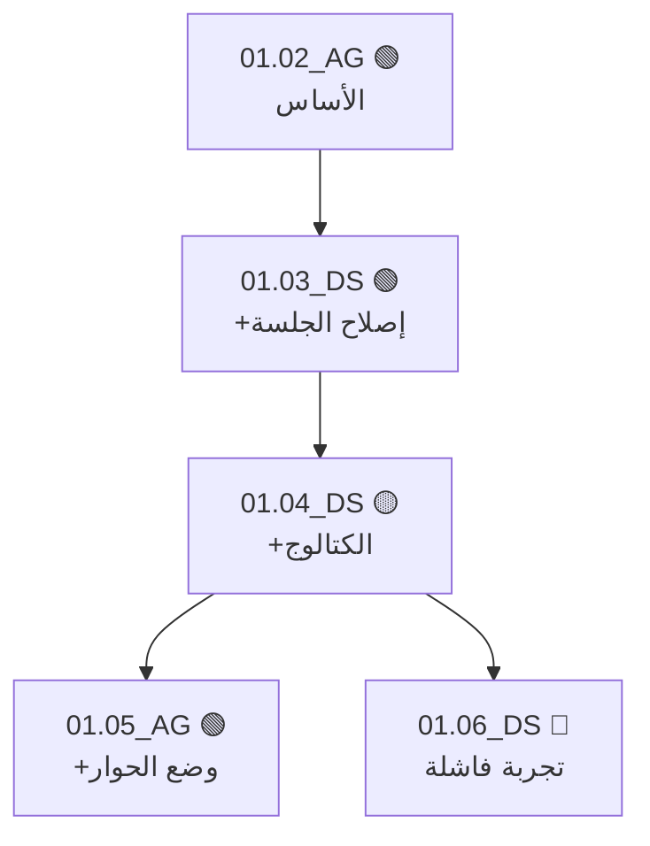

# 🧬 02.00 — بروتوكول SWARM-DNA
## أول منظومة تخلي مستودع Git يشتغل كـ"مستعمرة نمل رقمية" بحمض وراثي للكود

> **الحالة:** 📋 معتمد كطبقة V0.15 (بعد نواة V0.1 مباشرة)
> **درجة الابتكار:** 🚀 لا يوجد نظام منشور يجمع الأركان الثلاثة دي مع بعض
> في مستودع Git خام بدون أي سيرفر أو Framework.

---

## 💡 ليه ده جديد فعلاً؟ (تدقيق ضد الموجود عالمياً)

اتفحصت المنصات والأبحاث العالمية قبل التصميم (2026-08):

| الموجود عالمياً | إيه اللي بيعمله | إيه اللي ناقصه |
|---|---|---|
| **CrewAI / LangGraph / AutoGen** | تنسيق أيجنتات جوه **عملية تشغيل واحدة** (رسائل مباشرة في الذاكرة) | بيموت بموت العملية — مفيش ذاكرة حية عبر الجلسات والأيام والمنصات المختلفة |
| **EvoGit (بحث 2025)** | تطوير كود بأيجنتات عبر فروع Git | مفيش فيرومونات مهام، مفيش سمعة، مفيش عزل غرف |
| **CodeBolt StigmergySwarm** | فيرومونات لكن جوه runtime المنصة بتاعتهم | مقفول على منصتهم — مش Git خام يشتغل مع أي LLM |
| **Repowise Agent Provenance** | نسب الـ commits للأيجنتات (قراءة فقط) | تحليل بعدي — مش بروتوكول تشغيلي بيوجه سلوك الأيجنتات |

**الفجوة اللي بنسدها:** مفيش نظام واحد بيجمع
(١) فيرومونات تنسيق داخل Git + (٢) حمض وراثي للكود + (٣) سمعة محسوبة من التاريخ
في **ريبو خام** يشتغل مع **أي أيجنت من أي منصة** (Antigravity, DeepSeek, Gemini,
Claude, Copilot...) بدون تثبيت أي حاجة. ده هو SWARM-DNA.

---

## 🏛️ الأركان الثلاثة

### 🐜 الركن 1 — لوحة الفيرومونات (Pheromone Board)

**الفكرة:** زي ما النمل بينسق من غير ما يكلم بعضه — بيسيب أثر كيميائي في
البيئة — الأيجنتات هنا بتسيب "إشارات" في الريبو نفسه. **تنسيق بدون تواصل
مباشر** (Stigmergy) — وده مثالي لأيجنتات على منصات مختلفة مش شايفة بعضها.

**المكان:** `.connect/pheromones/` — كل إشارة ملف YAML صغير.

**أنواع الإشارات:**

| النوع | المعنى | TTL (صلاحية) | مثال |
|---|---|---|---|
| `CLAIM` | "أنا شغال على المهمة دي — متلمسهاش" | 4 ساعات | أيجنت بيبدأ T-007 |
| `WARN` | "فيه مشكلة هنا — خد بالك" | 7 أيام | ملف فيه bug معروف |
| `TRAIL` | "المسار ده نجح — اتبعه" | 30 يوم | طريقة تسجيل دخول شغالة |
| `NEED` | "محتاج حاجة من أيجنت تاني / من زيزو" | حتى الحل | محتاج قرار T-010 |

**صيغة الملف:** `{TYPE}_{CODE}_{slug}.yaml`

```yaml
# .connect/pheromones/CLAIM_AG_t007-new-agent-tool.yaml
type: CLAIM
agent: AG
target: "T-007"
created: "2026-08-25T14:00:00Z"
ttl_hours: 4
note: "بكتب أداة new_agent.py — التسليم المتوقع خلال جلستين"
```

**القواعد:**
1. قبل ما تبدأ مهمة: `git pull` → افحص `pheromones/` → لو فيه `CLAIM` ساري
   على مهمتك → **اختار مهمة تانية**.
2. الإشارة المنتهية الصلاحية (TTL عدى) تعتبر **هواء** — أي أيجنت يمسحها
   وياخد المهمة (حماية من أيجنت مات وساب حجز معلق للأبد).
3. لما تخلص المهمة: امسح الـ CLAIM بتاعك في نفس commit التسليم.
4. أداة `pheromone.py` بتدير كل ده: `claim` / `release` / `scan` / `sweep`.

> 🧠 **لمسة التعلم الجمعي:** إشارات `TRAIL` بتتراكم مع الوقت وبتتحول لخريطة
> "طرق ناجحة" — أيجنت جديد خالص بيستفيد من خبرة كل اللي قبله من غير ما
> يكلم حد. المستعمرة بتتعلم كجسم واحد.

---

### 🧬 الركن 2 — الحمض الوراثي للكود (Code DNA)

**الفكرة:** كل سكربت في المنظومة ليه "بطاقة جينية" في رأسه — مين ولده،
اتولد من مين، وجيله كام. ومنها بنبني **شجرة عائلة حية** لكل الكود.

**البطاقة الجينية (إلزامية في أول كل سكربت):**

```python
# ═══ DNA ═══
# Gene-ID:    ngpt/01.06_AG_agent-mode
# Based-On:   ngpt/01.05_DS_agent-mode
# Generation: 6
# Author:     AG (Antigravity)
# Mutation:   "إضافة إعادة المحاولة التلقائية عند فشل الجلسة"
# ═══════════
```

- **Gene-ID:** هوية فريدة = `{project}/{NN.NN}_{CODE}_{slug}`
- **Mutation:** سطر واحد يوصف **إيه اللي اتغير عن الأب** — ده أهم حقل:
  بيحول git history من "إيه اللي حصل" لـ"ليه حصل".

**الأداة:** `dna_tree.py` — تمشي على كل السكربتات وتبني شجرة Mermaid تلقائي:



الألوان من سجل الثقة (الركن 3): 🟢 سكربت متحقق منه، 🟡 لم يختبر، 🔴 فشل موثق.
الناتج بيتكتب في `projects/{slug}/DNA_TREE.md` — **زيزو يشوف تطور مشروعه
كله في صورة واحدة**.

> 🧠 **ليه ده قوي؟** لما أيجنت يبدأ شغل، بدل ما يخمن أنهي نسخة يبني عليها،
> بيقرا الشجرة: أحدث فرع 🟢 هو نقطة البداية الصح — دايماً.

---

### 🏆 الركن 3 — سجل الثقة (Trust Ledger)

**الفكرة:** سمعة لكل أيجنت **محسوبة آلياً من git history** — مش تقييم ذاتي
ولا انطباعات. الأرقام من الأفعال الموثقة فقط.

**مصدر البيانات:** Git Trailers الإلزامية في كل commit (قرار GAP-04):

```text
feat(ngpt): إضافة إعادة المحاولة التلقائية

Agent-Code: AG
Task-ID: T-007
Based-On: 01.05_DS_agent-mode
```

**المعادلة (بسيطة عمداً — قابلة للتدقيق يدوياً):**

| الحدث (يُقرأ آلياً من git) | النقاط |
|---|---|
| مهمة مكتملة بمعيار قبولها | +10 |
| سكربت بنى عليه أيجنت **آخر** لاحقاً (دليل جودة حقيقي) | +15 |
| إشارة `TRAIL` بتاعته استخدمها غيره | +5 |
| commit بدون Trailers صحيحة | −5 |
| كسر قاعدة عزل (لمس ملف أيجنت تاني) | −20 |
| `CLAIM` منتهي بدون تسليم ولا إلغاء | −10 |

**الناتج:** `TRUST_LEDGER.md` يتولد بأداة `trust_ledger.py`:

```text
| الأيجنت | النقاط | الرتبة | آخر 5 أحداث |
|---------|--------|--------|--------------|
| DS      | 85     | 🥇 Architect | +15 (بُني على 01.04) ... |
| AG      | 60     | 🥈 Builder   | +10 (T-007) ...          |
```

**الرتب:** `Scout` (0-29) → `Builder` (30-69) → `Architect` (70-149) → `Queen's Guard` (150+)

**الاستخدام العملي (مش مجرد ديكور):**
- المهام الموسومة `critical` في TASK_LOG ما يقدرش ياخدها غير `Builder` فأعلى.
- عند تعارض رأيين هندسيين، رأي صاحب الرتبة الأعلى يرجح (وزيزو دايماً فوق الكل).

> ⚖️ **عدالة النظام:** النقاط بتتحسب من commits موقعة بـ Trailers — أي حد
> يقدر يعيد الحساب بنفسه ويطلع نفس الأرقام. شفافية كاملة.

---

## 🔗 إزاي الأركان الثلاثة بيشتغلوا كجسم واحد

```text
   ┌──────────────┐   يوجه المهام    ┌──────────────┐
   │ 🐜 الفيرومونات│ ───────────────▶ │  الأيجنت      │
   └──────▲───────┘                  └──────┬───────┘
          │ TRAIL بعد النجاح                 │ يسلم كود بـ DNA + Trailers
          │                                 ▼
   ┌──────┴───────┐   يلون الشجرة    ┌──────────────┐
   │ 🏆 سجل الثقة  │ ◀─────────────── │ 🧬 شجرة الجينوم│
   └──────────────┘   يقرأ التاريخ    └──────────────┘
```

دورة كاملة: الأيجنت يقرا الفيرومونات → يحجز → يشتغل ويسلم كود ببطاقة جينية
→ الـ commit بـ Trailers يغذي سجل الثقة → الثقة تلون شجرة الجينوم → الشجرة
والـ TRAILs توجه الأيجنت الجاي. **المنظومة بتتعلم من نفسها بدون أي سيرفر.**

---

## 📦 مهام التنفيذ (مرحلة V0.15 — بعد اكتمال V0.1)

| Task | المهمة | الأداة |
|---|---|---|
| T-013 | لوحة الفيرومونات + `pheromone.py` (claim/release/scan/sweep) | 🔴 دي دخلت V0.1 لأنها بتسد GAP-01 الحرج |
| T-015 | `trust_ledger.py` + أول `TRUST_LEDGER.md` | V0.15 |
| T-016 | `dna_tree.py` + أول `DNA_TREE.md` لمشروع ngpt | V0.15 |
| T-017 | `doctor.py` — الفحص الذاتي الشامل | V0.15 |
| T-018 | اختبار قبول V0.15: دورة كاملة (فيرومون → تسليم → ثقة → شجرة) | V0.15 |

**حجم كل أداة:** ≤ 150 سطر Python، مكتبة قياسية فقط (+PyYAML) — صفر تبعيات ثقيلة.

---

## 🛡️ ضمانات عدم الـ Over-Engineering

1. كل الطبقة دي **ملفات نصية + 4 سكربتات صغيرة** — لو اتمسحت بالكامل،
   نواة V0.1 تفضل شغالة عادي (فك ارتباط تام).
2. مفيش أي سيرفر، مفيش قاعدة بيانات، مفيش webhooks — Git هو كل حاجة.
3. أي أيجنت من أي منصة يشارك بمجرد قراءة `PROTOCOL.md` — صفر تثبيت.

---
*Based-on: 02.01_GAP_ANALYSIS.md (GAP-01, 04, 07, 08, 09) + بحث المنصات العالمية 2026-08-25*
*مصادر الإلهام المتحقق منها: Stigmergy patterns (dev.to 2026-02), EvoGit (arXiv 2506.02049), Repowise Agent Provenance — ولا واحد فيهم بيعمل الدمج ده.*
