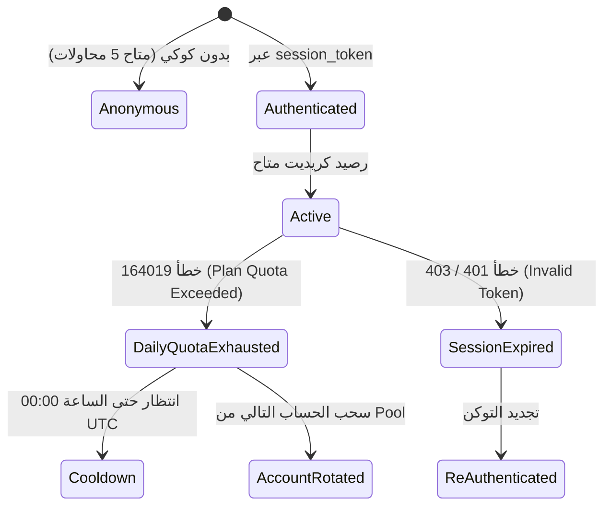

# 🔐 NoteGPT — Authentication & Account Lifecycle (`account.md`)

> **المزود:** NoteGPT (`notegpt.io`)  
> **حالة التوثيق:** `CONFIRMED` بناءً على ملفات HAR (`notegpt3......3...i.o.har`) وكود `01.05_notegpt_agent_mode.py`.

---

## 1. Authentication Mechanisms

| النوع | المدعوم | المصدر / الدليل | الوصف |
|---|---|---|---|
| **Session Token (Bearer Cookie)** | ✅ `CONFIRMED` | `01.05_notegpt_agent_mode.py` سطر 85-92 | كوكي `session_token` عبر Clerk Authentication |
| **Client Token (`__session`)** | ✅ `CONFIRMED` | `notegpt3......3...i.o.har` entry 19 | كوكي JWT يبدأ بـ `__session` |
| **API Key صريح** | ❌ `CONFIRMED_UNSUPPORTED` | فحص الـ HAR والواجهة | لا توفر منصة NoteGPT واجهة API Keys عامة، الاعتماد كلياً على Session Cookies |
| **CSRF Token** | ❓ `UNKNOWN` | فحص الـ Headers | غير مطلوب في معظم استدعاءات `POST /api/v2/ai-chat` |
| **Dynamic Fake IP (`X-Forwarded-For`)** | ✅ `CONFIRMED` | `01.05` سطر 145-156 | تدوير عشوائي لتفادي حظر الـ IP وتجاوز Cloudflare |

---

## 2. Account Lifecycle & State Machine

---

## 3. Account Lifecycle Fields

- **Registration / Sign Up:** يتم عبر Google OAuth أو البريد الإلكتروني المدعوم بـ Clerk.
- **Session Duration:** صلاحية الـ `session_token` تمتد عادة لـ **30 يوماً** في حال عدم تسجيل الخروج اليدوي.
- **Refresh Mechanism:** تلقائي عبر مزامنة الكوكيز مع خوادم Clerk (`clerk.notegpt.io`).
- **Cooldown Behavior:** عند الوصول للحد الأقصى للرسائل، يتم تطبيق تبريد لمدة **60 ثانية** أو الانتظار لتجديد الكوتا اليومية.
