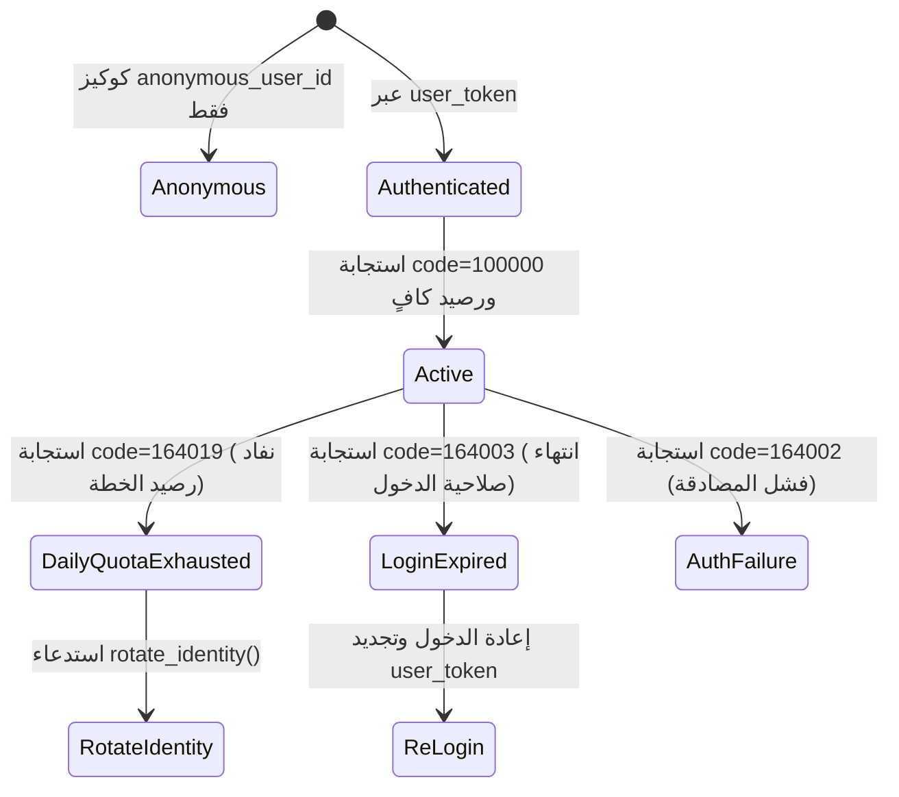

# 🔐 NoteGPT — Authentication & Account Lifecycle (`account.md`)

> **المزود:** NoteGPT (`notegpt.io`)  
> **حالة التوثيق:** `CONFIRMED` بناءً على فحص كود `01.05_notegpt_agent_mode.py:484-488` و 916 مدخل في ملفات الـ HAR.

---

## 1. Authentication Mechanisms

| البند | القيمة الحقيقية المؤكدة | الدليل / المصدر (Evidence) |
|---|---|---|
| **نوع المصادقة** | Token / Cookie Based | `01.05:484-488` |
| **اسم الكوكي الرئيسي** | **`user_token`** | `01.05:488` |
| **كوكيز المعرفات المرافقة** | `anonymous_user_id` · `sbox-guid` | `01.05:484-485` |
| **هيدر التوكن البديل** | `Authorization: Bearer <user_token>` | `01.05:573` |
| **نقطة تسجيل الدخول** | `POST /api/v1/auth/email/login` | `01.05:117` + استجابة HAR `200 OK` |
| **معلومات المستخدم** | `GET /api/v1/userinfo` | HAR ×10 |
| **صلاحية الجلسة (TTL)** | `UNKNOWN` (لا يوجد وقت انتهاء ثابت معلن) | فحص الـ HAR |
| **حماية CSRF** | `UNKNOWN` (غير مطلوب في الاستدعاءات الحالية) | فحص الـ Headers |
| **API Key عام ومستقل** | `UNKNOWN` (المنصة تعتمد واجهة الويب والجلسات) | فحص الواجهة |

---

## 2. بنية الكوكيز البرمجية الفعلية في الكود (`01.05`)

```python
# كود المصادقة الحقيقي في 01.05 (سطر 484-488)
self.cookies = {
    "anonymous_user_id": self.anon_user_id,
    "sbox-guid":         self.sbox_guid,
}
if self.session_token:
    self.cookies["user_token"] = self.session_token   # ← الاسم الصحيح في الخادم
```

---

## 3. دورة حياة الحساب (Account Lifecycle)


