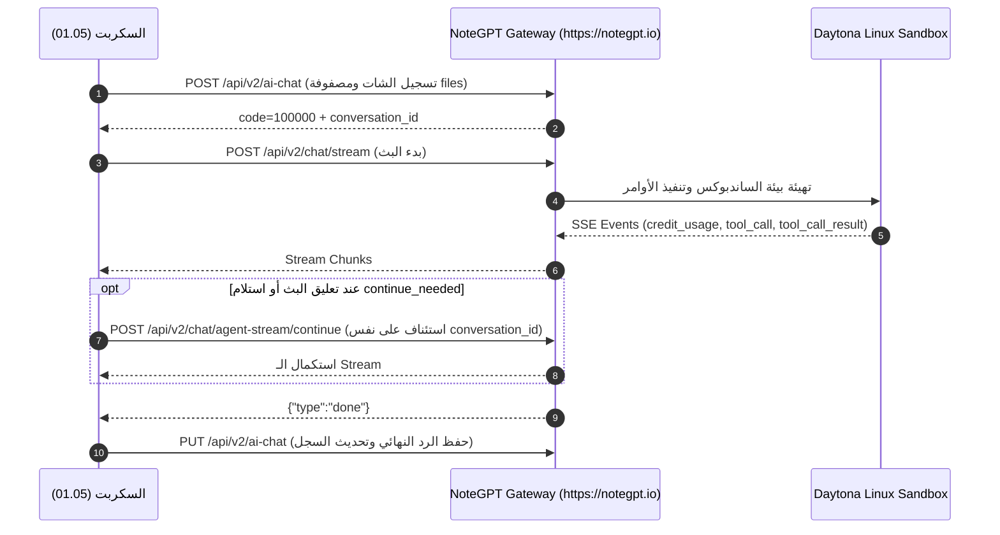

# 📡 NoteGPT — Generation Flows & Streaming Protocol (`generation.md`)

> **المزود:** NoteGPT (`notegpt.io`)  
> **حالة التوثيق:** `CONFIRMED` بناءً على كود `01.05:89-90` و 62 ظهور في ملفات الـ HAR.

---

## 1. الـ Endpoints الحقيقية للـ Generation والتوليد

| الغرض | الـ Endpoint الفعلي | Method | الدليل في الكود والـ HAR |
|---|---|---|---|
| **بدء التوليد والبث (Stream)** | **`/api/v2/chat/stream`** | `POST` | `01.05:89` · HAR ×62 |
| **استئناف البث (Auto-Continue)** | **`/api/v2/chat/agent-stream/continue`** | `POST` | `01.05:90` · HAR ×10 |
| **تسجيل / جلب / تحديث الشات** | **`/api/v2/ai-chat`** | `GET` / `POST` / `PUT` | `01.05:635,681` · HAR ×119 |
| **قائمة الوكلاء المخصصين** | **`/api/v1/agent/share/list`** | `GET` | HAR ×16 · `01.05` (`--agents`) |

**النطاق الأساسي:** `https://notegpt.io` (`01.05:92`)

---

## 2. قائمة أحداث الـ SSE الحقيقية (7 أحداث مؤكدة)

| اسم الحدث الفعلي | الوظيفة في التدفق | الدليل في كود `01.05` |
|---|---|---|
| **`credit_usage`** | إبلاغ العميل بكمية الكريديت المستهلكة | `01.05:713,839,856` |
| **`tool_call`** | استدعاء أداة ساندبوكس (bash / image_recognition) | `01.05:716,860` |
| **`tool_call_result`** | استلام مخرجات تشغيل الأداة في دايتونا لينكس | `01.05:722,867` |
| **`{"type":"done"}`** | انتهاء التوليد واكتمال استجابة النموذج | `01.05:734,885,907` |
| **`continue_needed`** | إشعار بضرورة إرسال طلب استئناف | `01.05:911` |
| **`agent_tool_limit`** | وصول الأيجنت للحد الأقصى من استدعاء الأدوات | `01.05:736,887` |
| **`length`** | انتهاء التوليد بسبب الوصول لطول السياق الأقصى | `01.05:736,887` |

---

## 3. مسار التدفق الكامل (End-to-End Sequence)

