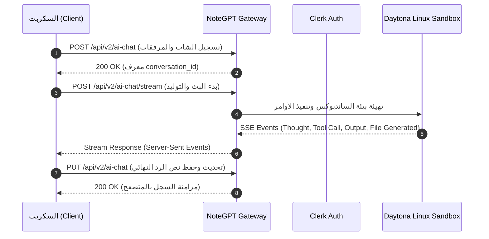

# 📡 NoteGPT — Generation Flows & Streaming Protocol (`generation.md`)

> **المزود:** NoteGPT (`notegpt.io`)  
> **حالة التوثيق:** `CONFIRMED` بناءً على ملفات الـ HAR (`notegpt3......3...i.o.har`) وكود `01.05`.

---

## 1. مسار الطلب الكامل (End-to-End Generation Flow)



---

## 2. هيكل الـ Payloads الرسمية

### أ. تسجيل الشات (`POST /api/v2/ai-chat`):
```json
{
  "title": "عنوان المحادثة",
  "model": "deepseek-chat",
  "files": [
    {
      "name": "screenshot.png",
      "url": "https://cdn.ng-resource.com/...",
      "type": "image/png",
      "size": 54918
    }
  ]
}
```

### ب. بدء تدفق البث (`POST /api/v2/ai-chat/stream`):
```json
{
  "conversation_id": "7a92a5b4-11ba-4bbc-9ba2-e610897e10d5",
  "message": "نص السؤال المطلوب تنفيذه",
  "model": "deepseek-chat",
  "agent_mode": true,
  "stream": true
}
```

---

## 3. معالجة أحداث الـ SSE Stream

الخادم يرسل أحداث متدفقة تبدأ بـ `data: `:
1. `{"type": "thought", "content": "..."}` ➔ أفكار النموذج وخطوات التحليل.
2. `{"type": "tool_call", "name": "bash", "args": {...}}` ➔ استدعاء أدوات الساندبوكس.
3. `{"type": "tool_result", "output": "..."}` ➔ نتيجة تشغيل الكود في لينكس.
4. `{"type": "credit", "used": 2}` ➔ الكريديت المستهلك في الجولة.
5. `data: [DONE]` ➔ اكتمال الرد بنجاح.
