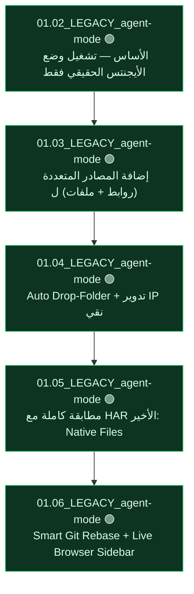

# 🧬 DNA_TREE.md — شجرة جينوم مشروع `ngpt`
> تتولد آلياً بـ `dna_tree.py` — آخر توليد: 2026-08-26

| الملف | الجيل | المؤلف | الحالة | الطفرة |
|---|---|---|---|---|
| `01.02_notegpt_agent_mode.py` | 1 | LEGACY | 🟢 | الأساس — تشغيل وضع الأيجنتس الحقيقي فقط عبر Pure Requests |
| `01.03_notegpt_agent_mode.py` | 2 | LEGACY | 🟢 | إضافة المصادر المتعددة (روابط + ملفات) لوضع الأيجنتس |
| `01.04_notegpt_agent_mode.py` | 3 | LEGACY | 🟢 | Auto Drop-Folder + تدوير IP نقي |
| `01.05_notegpt_agent_mode.py` | 4 | LEGACY | 🟢 | مطابقة كاملة مع HAR الأخير: Native Files Payload + History Sync |
| `01.06_notegpt_agent_mode.py` | 5 | LEGACY | 🟢 | Smart Git Rebase + Live Browser Sidebar Sync |

*🟢 موثوق (verified أو مؤلفه Builder+) · 🟡 لم يُختبر · 🔴 فشل موثق*
